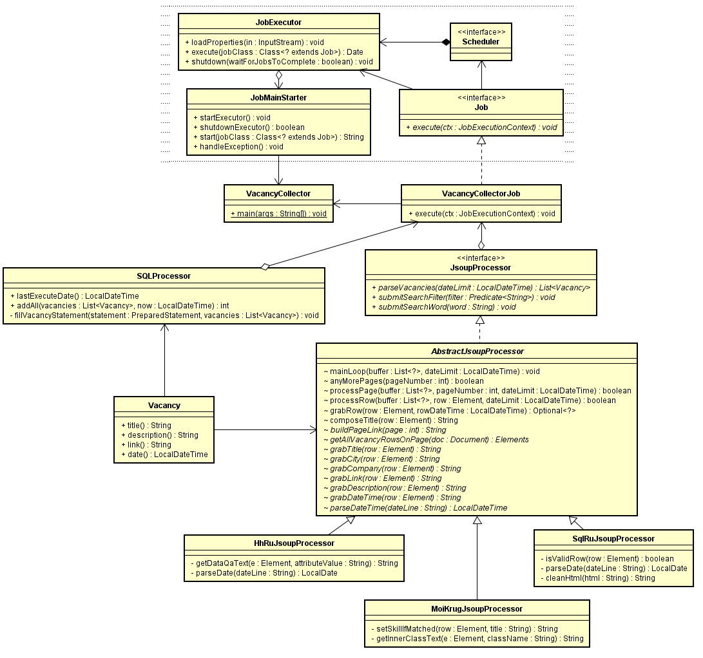
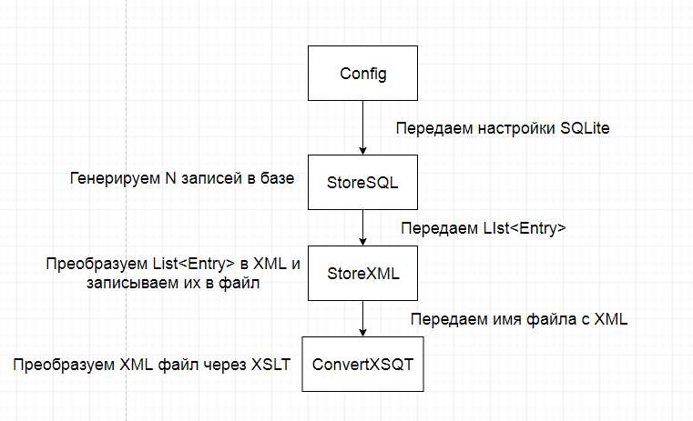

## <a href="https://github.com/svedentsov/job4j/tree/master/2_chapter_003/src/main/java/ru/job4j/vacancy">Консольное приложение «Граббер вакансий»</a>
### Приложение должно заходить на сайт и собирать Java вакансии в БД
1. Реализовать модуль сборки анализа данных с sql.ru.
2. Система должна использовать Jsoup для парсинга страниц.
3. Система должна запускаться раз в день.
#### Схема:

## <a href="https://github.com/svedentsov/job4j/tree/master/2_chapter_003/src/main/java/ru/job4j/xml">XML XSLT JDBC Оптимизация</a>
### Нужно произвести процесс манипуляции над данными
1. Генерация данных в SQLLite.
2. Генерация XML из данных базы.
3. Трансформация полученного XML-файла в файл с другой XML схемой.
4. Парсинг выходного файла, вывод арифметической суммы значений всех атрибутов.
#### Схема:
